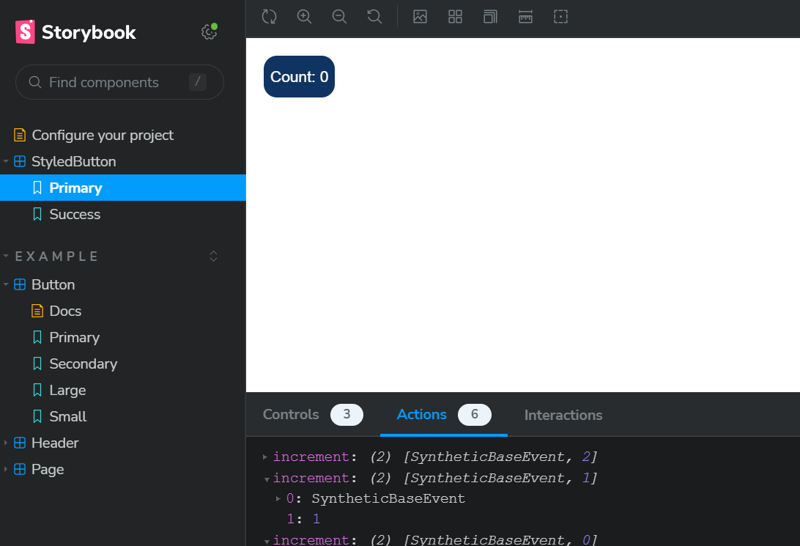
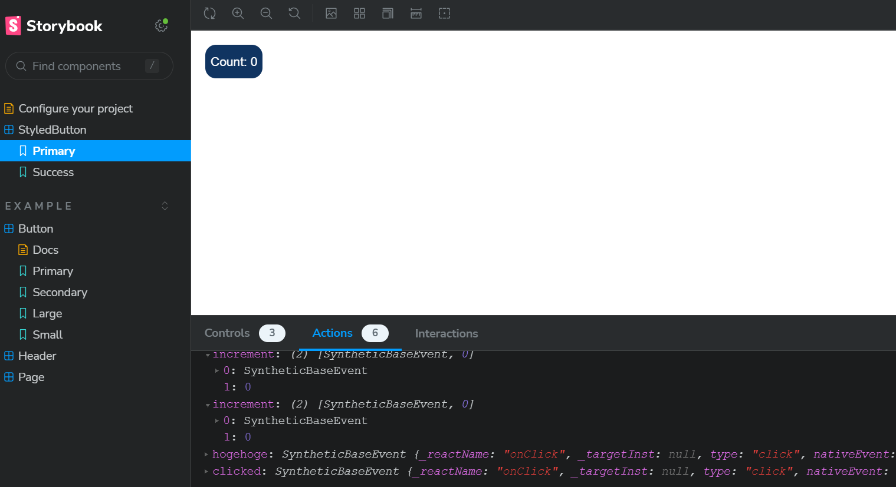
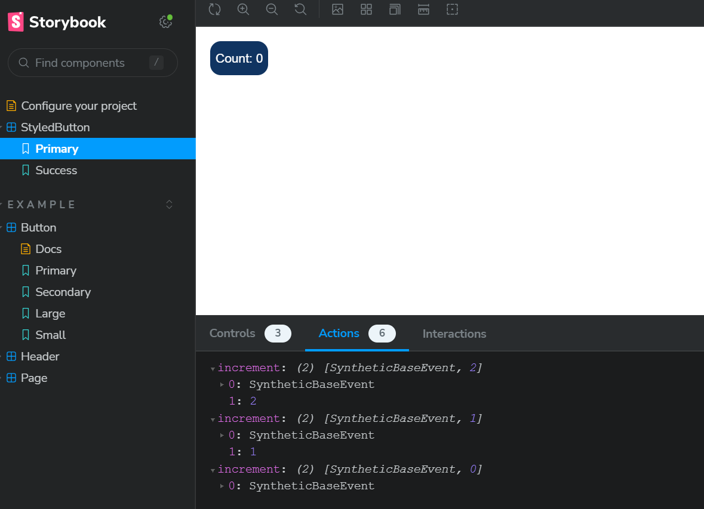
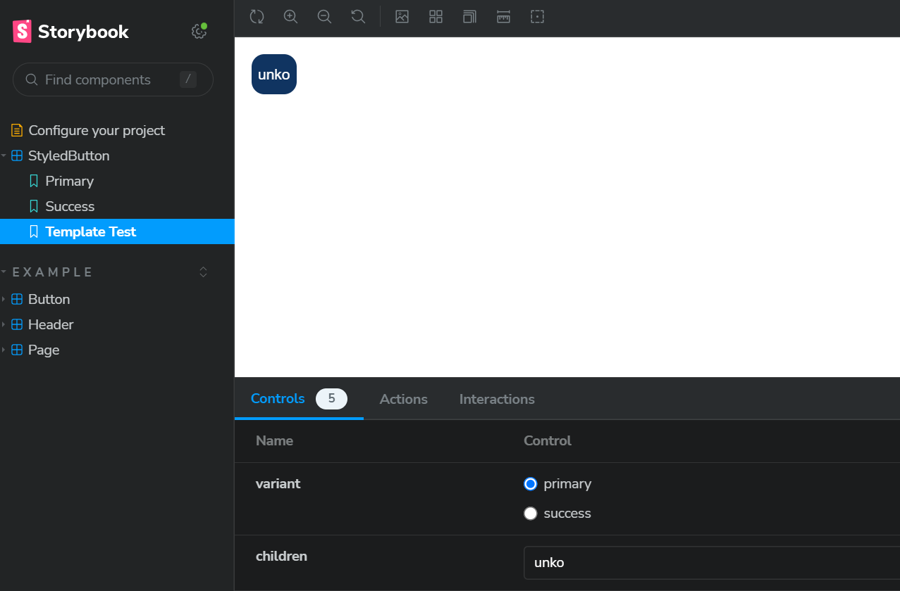

学習メモ

## Next.jsに備わる各コンポーネント
### Link
他のページへ遷移するコンポーネント。  
実体はaタグで、内部でこの要素がラッピングされている。  
href属性で遷移先ページのリンクを指定する。  
LinkコンポーネントのpropsはLinkPropsで定義されている。

### PropsWithChildren
childrenの型を定義する。  

childrenを関数コンポーネントで受け取る際、childrenの型を次のように定義するのがやり方の1つ。
```sample.tsx
function Component({ children }: { children: ReactNode; }) {
    ...
};
```

PropsWithChildrenを使えば↑よりも簡潔に書ける。
```sample.tsx
function Component({ children }: PropsWithChildren) {
    ...
};
```

propsを追加したい場合は以下のように書く（&の後に記載）。
```sample.tsx
function Component({ children }: PropsWithChildren & {
    color:string;
}) {
    ...
};
```

もしくはpropsの型を予め定義し、PropsWithChildrenのジェネリクスでpropsの型を指定する。
```sample.tsx
type HogeType = { color:string }

function Component({ children }: PropsWithChildren<HogeType>) {
    ...
};
```


## メモ化
関数や変数の値を保持し、同一の呼び出しがあったときにその値を返す（再利用する）仕組み。

## フック

### useCallback
コールバック関数をメモ化し、その関数を返すフック。  
useCallback(関数, [])  
　第1引数にメモ化する関数を指定  
　第2引数に配列を指定  

コンポーネントの再描画が行われる際のuseCallbackの挙動は以下のようになる  
　再描画前と再描画後で配列の中の値が同じ→メモ化時に作成した関数を返す  
　再描画前と再描画後で配列の中の値が異なる→新しく関数を作成し、それを返す  

基本的に、再描画に伴う不要な関数の再作成を防ぐためにuseCallbackが使われる  
　→こうすることでパフォーマンス向上につながる  

## Atomic Design
一貫性のあるデザインを作るための考え方、方法論。  
Atomic Designでは、コンポーネントを以下の階層に分類し、各階層ごとにコンポーネントを定義する。  
　Atoms  
　Molecules  
　Organisms  
　Templates  
　Pages  

### Atoms
これ以上分割できないコンポーネント。  
（例：ボタン、テキストなど）

Atomsは以下の特徴を持つ。  
　状態やふるまいを持たない（ビジネスロジックを持たない）  
　見た目の設定に必要なパラメータはpropsで受け取る（汎用的に使えるようにするため）


### Molecules
複数のAtomsを組み合わせたコンポーネント。  
（例：ラベル付きのボタンなど）

Moleculesも状態やふるまいを持たず、汎用的に使えるようにするために親から値を受け取って見た目を定義する。  

### Organisms
複数のMoleculesやAtomsを組み合わせたコンポーネント。  
Moleculesよりも具体的なUIを定義するものが該当。  
（サインインフォーム、ヘッダーなど）

また、状態やふるまいを持つ。  
　Presentational Componentで見た目を定義  
　Container Componentでビジネスロジック（ふるまい等）を定義  

### Templates
ページ全体のレイアウトを定義するコンポーネント。  
複数のOrganism以下のコンポーネントを組み合わせ、それらをCSSでレイアウトする。  

### Pages
ページ単位のコンポーネント。    
Pagesでは状態管理やAPIコールなどのふるまいに関するものを実装。  
（レイアウトはTemplatesで管理）  

Pageコンポーネントはpagesディレクトリ直下に配置し、export defaultを指定する。  
Pageコンポーネントの型はNextPageである。

## styled-component
CSS in JSの1つ。  
htmlの各要素やコンポーネントのスタイル（レイアウト）を、各コンポーネントのtsxファイル内で定義する。  
スタイルはCSSで定義するのと同じ。  
styled-componentで定義したスタイルは、描画時にスタイルを作成する。  
そして、そのスタイルに紐づくclassNameを対象コンポーネントのclass属性に指定する。  
このようにして、対象コンポーネントにCSSのレイアウトが反映されるようになっている。

styled-componentで定義したスタイルの先頭文字は大文字にする（小文字だとエラーになる）。  
また、スタイルはprops経由でレイアウトに値を渡すこともできる。  
propsを使う場合、<>でpropsの型を指定する。
```sample.tsx
const Button = styled.button<ButtonProps>`
    /* color, background, borderはpropsの値を使用 */
    color: ${(props) => props.color};
    background: ${(props) => props.backGroundColor};
    border: 2px solid ${(props) => props.color};

    font-size: 2em;
`;
```

コンポーネントのスタイルを定義する場合、継承形式で定義する。  
コンポーネント側では、propsで渡されるclassNameを対象コンポーネントのclassName属性に指定する。
```sample.tsx
//propsで渡されるclassNameを対象コンポーネントのclassName属性に指定する
const BaseLink = (props: BaseLinkProps) => {
    const {className, children, ...rest} = props;
    return (
        <Link {...rest} className={className}>
            {children}
        </Link>
    );
}

//コンポーネントのスタイル定義は、継承形式で。
const StyledLink = styled(BaseLink)`
    color: blue;
    font: 15px;
`;
```

### mixin
CSSの定義を再利用する機能。  
CSSの定義を別のスタイルで使用できる。  
```sample.tsx
const redBox = css`
    padding: 0.25em 1em;
    border: 3px solid #ff0000;
    border-radius: 10px;
`;

const font = css`
    color: blue;
    font-size: 15px;
`;

//↑で定義したスタイルを利用
const AnotherButton = styled.button`
    ${redBox}
    ${font}
`;
```

### Theme
styled-componentの機能の1つ。  
別ファイルでCSSの値を定義し、外部コンポーネントから値を参照して利用することができる。  

```theme.ts
export const theme = {
    colors: {
        white: "#ffffff",
        black: "#000000",
        red: "#ff0000",
    },
    fontSizes: ["12px", "14px"]
};
```

Themeを使う際は、_app.tsxでThemeProviderを置き、themeプロパティに、cssの値が定義されたオブジェクトを渡す。  
```_app.tsx
export default function App({ Component, pageProps }: AppProps) {
  return (
    //Themeを使う際はThemeProviderを使用し、themeプロパティに値を渡す
    <ThemeProvider theme={theme}>
    <Component {...pageProps} />
    </ThemeProvider>
  ); 
}
```

コンポーネントでは、props.themeで値を参照する。 
```sample.tsx
import { NextPage } from "next";
import { styled } from "styled-components";

const Text = styled.span`
    color: ${(props) => props.theme.colors.red};
`;


const ThemeSample: NextPage = () => {
    return (
        <div>
            <Text>Themeから参照した色を使用</Text>
        </div>
    );
}

export default ThemeSample;
``` 

## Storybook
コンポーネント開発支援ツール。  
ブラウザ上でコンポーネントの表示を確認できる。  
これを使えば、確認用のページコンポーネントを用意しなくても、コンポーネントが正しく表示されているか確認できる。  

### 使用方法
以下のコマンドを実行。
```
$ npx sb@latest init
$ npm run storybook
```

起動が完了すると、自動でStorybookがブラウザ表示される。  
また、src配下にstoriesディレクトリが作成される。  


### コンポーネントの表示
storiesディレクトリに以下の名前のファイルを作成する。  
例：<コンポーネント名>.stories.tsx

export default内に、Storybook上での表示設定をまとめたオブジェクトをMeta型として定義  
　title：Storybook上での表示名  
　component：表示するコンポーネント  
　Metaのジェネリクスの型にはtypeofでコンポーネントを指定  
　※バージョン6まではComponentMetaが使われたが、7で非推奨になった
```sample.tsx
export default {
    // グループ名
    title: "StyledButton",
    // 使用するコンポーネント
    component: StyledButton,
} as Meta<typeof StyledButton>;
```

同じファイル内で、Storybookで表示するコンポーネントをreturnする変数をexportで定義。  
```sample.tsx
export default {
    // グループ名
    title: "StyledButton",
    // 使用するコンポーネント
    component: StyledButton,
} as Meta<typeof StyledButton>;

//変数名がStory上に表示される
export const Primary = (props) => {
    return (
        <StyledButton {...props} variant="primary">
            Count: {count}
        </StyledButton>
    )
};
```

Storybook上ではこのように表示される。  


Storybook上でコンポーネントのイベント発生時の挙動を確認するにはargTypesを使用。  
```
export default {
    // グループ名
    title: "StyledButton",
    // 使用するコンポーネント
    component: StyledButton,
    //onClickが呼ばれたときにclickedというアクションを出力する
    argTypes: { onClick: {action: "clicked"}},
} as Meta<typeof StyledButton>;
```

Storybook上でイベントが発生すると、Actionsタブにイベントが表示される。  


Actionsタブに任意の値をイベント内で表示したい場合は、actionモジュールを使う。  
```sample.tsx
import { Meta } from "@storybook/react";
import { StyledButton } from "../components/StyledButton";
import { action } from "@storybook/addon-actions";
import { useState } from "react";

export default {
    // グループ名
    title: "StyledButton",
    // 使用するコンポーネント
    component: StyledButton,
    //onClickが呼ばれたときにclickedというアクションを出力する
    //argTypes: { onClick: {action: "clicked"}},
} as Meta<typeof StyledButton>;

//任意のデータをActionタブに表示したい場合はactionで定義する
const incrementAction = action("increment");

//変数名がStory上に表示される
export const Primary = (props) => {
    const [count, setCount] = useState(0);
    const onClick = (e: React.MouseEvent) => {
        //actionで定義した関数の引数にActionタブで表示したい値を渡す
        incrementAction(e, count);
        setCount((c: number) => c + 1);
    }

    return (
        <StyledButton {...props} variant="primary" onClick={onClick}>
            Count: {count}
        </StyledButton>
    )
};
```
イベント実行後、actionで定義した関数の引数に渡した値がActionsタブで表示される。


コンポーネントに渡すpropsの制御はControlタブで行う。  
まず、メタデータ内のargTypesで、propsの値を定義する。  
そして、テンプレートコンポーネントを作成し、それをStoryに登録する。
```sample.tsx
import { Meta, StoryFn } from "@storybook/react";
import { StyledButton } from "../components/StyledButton";
import { action } from "@storybook/addon-actions";
import { useState } from "react";

export default {
    // グループ名
    title: "StyledButton",
    // 使用するコンポーネント
    component: StyledButton,
    //Controlタブでコンポーネントのpropsを制御する場合はargTypesでpropsの値を定義
    argTypes: {
        variant: {
            control: {type: "radio"},
            options: ["primary", "success"],
        },
        children: {
            control: {type: "text"},
        },
    },
} as Meta<typeof StyledButton>;

//バージョン7ではStoryは非推奨なのでStoryFnを使う
//テンプレートコンポーネントの作成
const Template: StoryFn<typeof StyledButton> = (args) => <StyledButton {...args}/>

//bind関数を呼び出し、テンプレートコンポーネントをStoryに登録
export const TemplateTest = Template.bind({});

//デフォルトのpropsを設定
TemplateTest.args = {
    variant: "primary",
    children: "primary"
}
```

argTypesで定義した内容で、Controlタブでpropsを制御できる。  
